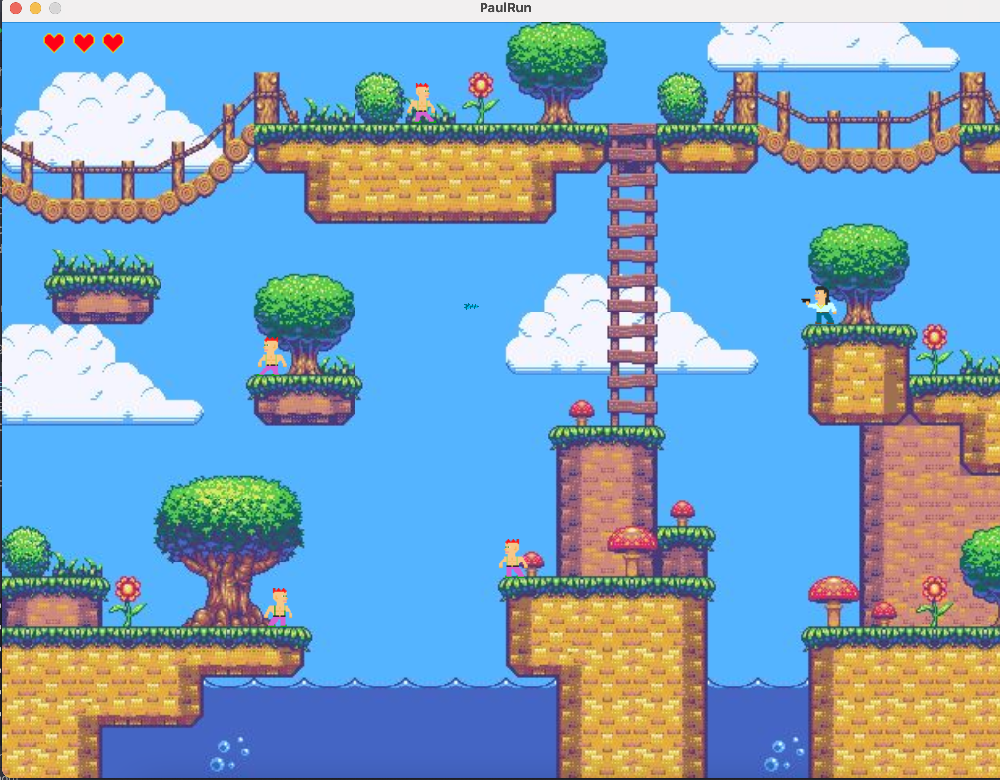

# PaulRun 

Is this repo useful? Please ⭑Star this repository and share the love.

Platform 2D Game base on ```Javax.Swing``` implemented in [Scala](https://www.scala-lang.org).

All Sprites has been implemented using [piskelapp](https://www.piskelapp.com/) webpage.

# 


## Engines

We have different engines that introduce the logic of the game:

* **HeroEngine:** All the logic and physics of gravity and collision of the character with the map and enemies.


* **PunkEngine:** All the logic and collision of the punk enemy with the map and thunderbolt.

 

* **BulletEngine:** All the logic and physics of direction of bullet.

## How to Play

Clone the repo, and run ```Main``` class

## Keyboard

```Up, Down, Left, Right``` keyboards to move

```Space``` to Jump

```F``` to Fire